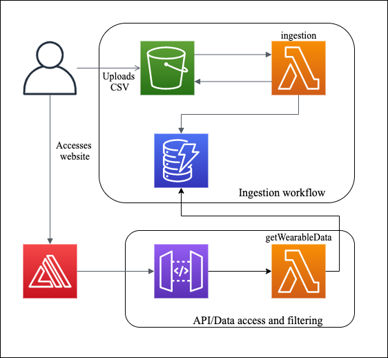

# Wearable metric dashboard

Note that there is no data for the last month, data starts from: `2021-03-21`

### Overview diagram:

### Stack used:
- Lambda's:
    - Python 3.7 with pandas
- UI
    - React and Node
    - CSS
    - Jest was setup for testing but not implimented
- AWS 
    - Lambda
    - S3
    - Dynamodb
    - Amplify
    - Api Gateway
    - IAM
    - Cloudwatch Logging

### File structure:
- `lambda` directory contains the lambda code (python) used to ingest and querry data
  - getWearableData is the lambda function connected to an API. This API is used to querry data stored in Dynamo DB. The API uses AWS Api Gateway to allow the lambda to be hit. We can provide the API with a date range to querry and the columnValues/metrics that we want to view. 
  - An example curl and response used to hit the API is:
    - `curl -X POST -H "x-api-key:API_Key" -H "Content-Type: application/json" Endpoint_URL a -d "{\"date\": \"2021-03-13,2021-03-19\",\"columnValues\": \"AL, CL\"}"`
    - `{"AL": [39.8242486030958, 40.951995846465, 46.3475261987231, 36.3846603062292, 38.1569252846543], "CL": [36.2065369428448, 36.8012046612011, 37.461086631596, 35.6837346645221, 36.4048584265747]}`
  - ingestionLambda is the lambda used to batch ingest data to Dynamo DB from a file/object placed in an S3 bucket.
- The rest of the repo is oriented towards the website. View App.jsx for the react code driving the website.
- data/testData was used to test the ingestionLambda and is a subset of the overall dataset

### Running website:
`Run npm start`

### Short term improvemets I should have liked to make:
- UI
    - Use chart.js as the graph library instead, I discovered too late that the labels options mentioned on the git page of the library I used were not present and I could not angle the x axis labels. Therefore the x axis labels of the graph are the "Activity number" and note the start date and time of the activity due to labels overlapping. I have console log'd the labels to show what was intended for the graphs.
    - Display data as a table as well/give the option to switch betwen a table and graoh view.
    - Create a grid to display graphs in closer proximity to each other or not based on how much data is provided.
    - Use a different graph library to allow scrolling so data doesnt become squashed when viewed for a year.
    - Use a Date range picker instead of string.
    - Display the number of workouts in different time buckets on a overall global graph/summary table, possibly by month.
    - Display each activity type as a different colour on the graph when `all` is selected.
    - Add testing.
    - General UI usability improvements.
    - Don't display labels when lots of data is returned.
    - Validate inputs.
- Backend
    - API to ingest just one datapoint.
    - Add User ID to DB so multiple users can be on the same system/table.
    - Some intellegence on the API to return aggregate data/analysed data.
    - Scaling Lambda and DB and evaluating optomisations.
    - Rework the table to optomise more searches, change GSI.
    - Add more security on the API.
    - Add more response code's to make API errors more user readable and usable.
    - Backup tables for redundancy.
    - Create API Docs.
